# Exploring the CrowPanel Advanced 10.1-inch ESP32-P4 HMI Display

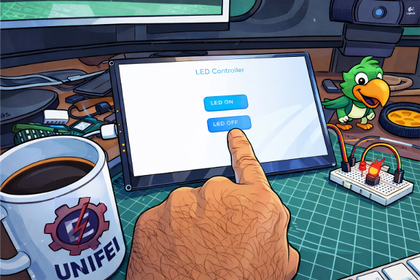

---

## Table of Contents

1. [Overview](#overview)
2. [Main Hardware Specifications](#main-hardware-specifications)
3. [Lessons at a Glance](#lessons-at-a-glance)
4. [Prerequisites](#prerequisites)
5. [Development Environment Setup](#development-environment-setup)
6. [Lesson 02 — Turn on the LED (Blink)](#lesson-02--turn-on-the-led-blink)
7. [Lesson 07 — Turn on the Screen](#lesson-07--turn-on-the-screen)
8. [Lesson 09 — LED Control via Touch Screen](#lesson-09--led-control-via-touch-screen)
9. [Lesson 10 — Temperature & Humidity Sensor](#lesson-10--temperature--humidity-sensor)
10. [Mini-Project — Home Panel Controller](#mini-project--home-panel-controller)
11. [Lesson 16 — Live Weather via Wi-Fi](#lesson-16--live-weather-via-wi-fi)
12. [Conclusion](#conclusion)

---

## Overview

The [Elecrow CrowPanel Advanced 10.1-inch ESP32-P4 HMI AI Display](https://www.elecrow.com/crowpanel-advanced-10-1inch-esp32-p4-hmi-ai-display-1024x600-ips-touch-screen-wifi-6.html) is a serious piece of hardware for anyone interested in building rich, connected embedded interfaces. At its heart sits the ESP32-P4 — Espressif's first application-class RISC-V chip — paired with a vivid 1024×600 IPS capacitive touchscreen, Wi-Fi 6, onboard audio, and ample memory. The result is a self-contained "smart panel" that sits comfortably between a bare microcontroller and a full single-board computer.

This tutorial takes a **progressive, hands-on approach**: rather than jumping straight to a polished demo, we build understanding layer by layer — starting from a single blinking LED, moving through display initialization, touch input, local sensor integration, and finally live weather data fetched from the internet. Each lesson introduces only what is new, so by the end you will have a clear mental model of how all the pieces fit together.

By the end of this tutorial you will be able to:

- Control GPIO output and structure firmware using ESP-IDF components and FreeRTOS tasks (Lesson 02)
- Initialize the MIPI DSI display pipeline and draw rich interfaces with LVGL (Lesson 07)
- Handle capacitive touch events to drive real UI interactions (Lesson 09)
- Read a DHT20 temperature and humidity sensor over I2C and display live data (Lesson 10)
- Connect to Wi-Fi 6, perform an HTTPS request, and parse a live weather API response on-device (Lesson 16)

No prior ESP-IDF experience is required, but comfort reading C code and basic familiarity with microcontrollers will help. All examples are drawn from the official Elecrow repository; we will study, run, and modify them rather than writing everything from scratch.

---

## Main Hardware Specifications

| **Specification**       | **Details**                                                              |
|-------------------------|--------------------------------------------------------------------------|
| MCU                     | ESP32-P4 (RISC-V dual-core 400 MHz + LP core, AI accelerator)           |
| Display                 | 10.1" IPS, 1024×600, 16M colors, capacitive touch (5-point)             |
| Connectivity            | Wi-Fi 6 (802.11ax), Bluetooth 5.3 (via ESP32-C6 co-processor)           |
| Memory                  | 32 MB Flash, 32 MB PSRAM                                                 |
| Interfaces              | USB-C, UART, I2C, SPI, SDMMC, GPIO expansion                            |
| Power                   | USB-C 5V or external DC, LiPo battery connector                         |
| Dimensions              | 257 × 163 × 10 mm                                                       |
| SDK Support             | ESP-IDF, Arduino IDE, LVGL, MicroPython                                 |
| Audio                   | Audio amplifier, microphones, dual speakers                             |

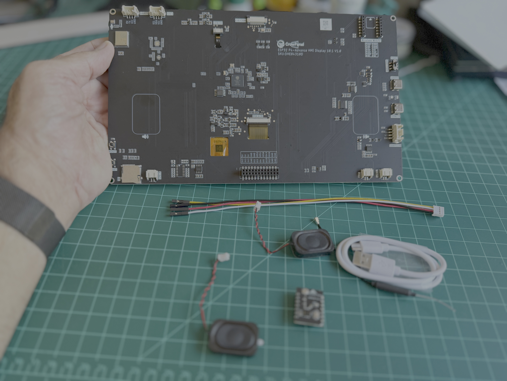

---

## Lessons at a Glance

The [Elecrow GitHub repository](https://github.com/Elecrow-RD/CrowPanel-Advanced-10.1inch-ESP32-P4-HMI-AI-Display-1024x600-IPS-Touch-Screen/tree/master/example/V1.0/idf-code) contains several ready-to-run examples. This tutorial focuses on five that build cleanly on one another:

| Lesson | Topic | What You Will Learn | Est. Time |
|--------|-------|---------------------|-----------|
| 02 | Turn on the LED | GPIO output, ESP-IDF components, FreeRTOS tasks | ~20 min |
| 07 | Turn on the Screen | MIPI DSI, LVGL initialization, drawing text and shapes | ~30 min |
| 09 | LED via Touch Screen | Capacitive touch, LVGL buttons and event callbacks | ~20 min |
| 10 | Temperature & Humidity | I2C, DHT20 driver, periodic sensor tasks | ~25 min |
| 16 | Wi-Fi Weather | Wi-Fi 6, HTTPS GET, cJSON parsing, live API data | ~40 min |

---

## Prerequisites

**Software**

- ESP-IDF v5.3 or later ([installation guide](https://docs.espressif.com/projects/esp-idf/en/stable/esp32p4/get-started/))
- VS Code with the ESP-IDF extension, or `idf.py` command-line tools
- CrowPanel repository cloned from GitHub (see setup below)

**Hardware**

- CrowPanel Advanced 10.1" ESP32-P4
- Breadboard
- 1× Grove/Crowtail 4-pin DuPont cable
- 1× LED + 220 Ω resistor
- DHT20 sensor module with Grove/I2C connector (for Lesson 10 and the mini-project)

---

## Development Environment Setup

### Installing ESP-IDF

The CrowPanel examples use the ESP-IDF (Espressif IoT Development Framework). The steps below apply to Linux, macOS, and Windows.

1. Download the ESP-IDF installer from the [ESP32-P4 getting started page](https://docs.espressif.com/projects/esp-idf/en/stable/esp32p4/get-started/).

2. Run the installer and follow the prompts, accepting the default installation directory.

3. Open a new terminal and verify the installation:

```bash
idf.py --version
```

4. Set the target chip to ESP32-P4:

```bash
idf.py set-target esp32p4
```

### Cloning the Repository

```bash
git clone https://github.com/Elecrow-RD/CrowPanel-Advanced-10.1inch-ESP32-P4-HMI-AI-Display-1024x600-IPS-Touch-Screen.git
cd CrowPanel-Advanced-10.1inch-ESP32-P4-HMI-AI-Display-1024x600-IPS-Touch-Screen
```

### Building and Flashing a Project

5. Connect the CrowPanel to your PC via the USB-C port.

6. Navigate to an example directory:

```bash
cd example/V1.0/idf-code/Lesson02-Turn_on_the_LED
```

> On VS Code, go to `File` → `Open Folder` → select the project folder.

7. Build the project:

```bash
idf.py build
```

8. Flash to the board (adjust the port for your system — macOS uses `/dev/cu.usbserial-*`):

```bash
idf.py -p /dev/ttyUSB0 flash
```

> **Manual bootloader sequence (if flashing fails):** Unplug USB. Press and hold the **BOOT** button, then plug USB back in (or briefly tap **RESET** if already powered). Hold BOOT for 1–2 seconds, then release. The board stays in download mode until you flash or power-cycle it.

---

## Lesson 02 — Turn on the LED (Blink)

**Objective:** Configure a GPIO pin as an output and toggle an external LED. This is the classic "Hello World" of embedded systems. *(~20 min)*

### Hardware

The CrowPanel exposes several user-accessible GPIOs. In this lesson we use the **Grove UART1** header in the upper-left of the rear panel, which despite its label provides two freely-usable GPIO pins (RX and TX).


Key points about GPIO on the ESP32-P4:

- About 55 general-purpose GPIOs are available, configurable as inputs, outputs, PWM, ADC, I2C, SPI, and more.
- Each GPIO can source/sink up to ~40 mA — enough to drive small LEDs directly with a current-limiting resistor.
- By default, Lesson 02 expects an LED connected to the **RX pin** of Grove UART1 (yellow wire), which maps to **GPIO 48**.

Connect the LED to the UART1 header as shown in the Elecrow wiring diagram: LED anode → GPIO 48 (RX/yellow), cathode → GND, with a 220 Ω resistor in series.

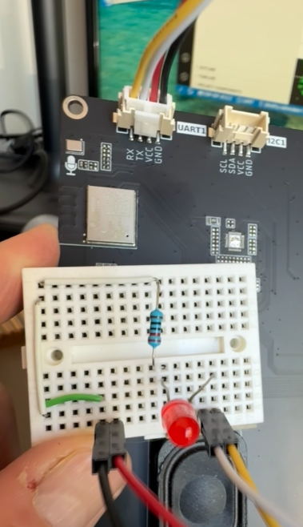

### Project Structure

Open the `Lesson02-Turn_on_the_LED` folder in VS Code. The structure is:

- `main/` — application entry point (`main.c`)
- `peripheral/bsp_extra/` — custom component for GPIO control
  - `bsp_extra.c` — GPIO configuration and control functions
  - `include/bsp_extra.h` — declarations and macros
  - `CMakeLists.txt` and `Kconfig` — ESP-IDF build integration

The `bsp_extra` component cleanly separates LED-related GPIO logic from the main application, a pattern that repeats throughout every subsequent lesson.

### The GPIO Driver: `bsp_extra`

#### `bsp_extra.h`

The header defines a single place for includes, pin macros, and function prototypes:

- Includes ESP-IDF's GPIO driver header.
- Defines a macro for the LED pin (e.g., `GPIO48`).
- Declares two functions:
  - `esp_err_t gpio_extra_init(void)` — configures the LED pin as an output.
  - `void gpio_extra_set_level(bool level)` — sets the pin high or low.

#### `bsp_extra.c`

The source file implements the hardware logic:

1. `gpio_extra_init()` creates a `gpio_config_t` structure, sets `.pin_bit_mask = (1ULL << 48)`, `.mode = GPIO_MODE_OUTPUT`, disables pull-up/pull-down and interrupts, and calls `gpio_config()`.

2. `gpio_extra_set_level(bool level)` is a thin wrapper around `gpio_set_level(48, level)`.

With these two functions, all other code can control the LED without touching `gpio_config_t` or pin numbers directly.

#### CMake and Kconfig

`peripheral/bsp_extra/CMakeLists.txt` lists `bsp_extra.c` in `SRCS`, adds `include` to `INCLUDE_DIRS`, and declares `driver` in `REQUIRES` so the GPIO driver is linked. The `Kconfig` file makes the component's configuration options visible in menuconfig.

### Main Application Logic: `main.c`

In ESP-IDF there is no `int main()`. The framework calls `void app_main(void)` once the system is ready.

`main.c` includes FreeRTOS headers (`freertos/FreeRTOS.h`, `freertos/task.h`) and `bsp_extra.h`, then proceeds in two steps.

#### LED Blinking Task

Instead of blocking inside `app_main`, the example creates a dedicated FreeRTOS task:

```c
void led_blink_task(void *pvParameters)
{
    while (1) {
        gpio_extra_set_level(true);             // LED ON
        vTaskDelay(pdMS_TO_TICKS(1000));        // wait 1 second

        gpio_extra_set_level(false);            // LED OFF
        vTaskDelay(pdMS_TO_TICKS(1000));        // wait 1 second
    }
}
```

`vTaskDelay(pdMS_TO_TICKS(1000))` suspends the task for 1000 ms using the FreeRTOS tick conversion macro — this yields the CPU to other tasks instead of busy-waiting.

#### `app_main`

```c
void app_main(void)
{
    gpio_extra_init();  // configure GPIO48 as output

    xTaskCreate(led_blink_task,   // task function
                "led_blink_task", // debug name
                2048,             // stack size in bytes
                NULL,             // no parameters
                5,                // priority
                NULL);            // no task handle needed
}
```

Once created, `led_blink_task` runs in the background indefinitely while `app_main` returns control to the scheduler.

### Building and Flashing in VS Code

1. Connect the CrowPanel via USB.
2. In the ESP-IDF extension, select the correct ESP-IDF version, serial port, upload method, and chip type (ESP32-P4).
3. Open SDK Configuration (menuconfig) and verify flash settings match Elecrow's recommendations.
4. Click **Build**, then **Flash**.

After a successful upload, the LED connected to the UART1 header will blink ON for 1 second and OFF for 1 second, repeating indefinitely.

### Changing the LED GPIO

To blink a different GPIO — for example, GPIO 28 on the 24-pin expansion header — edit `bsp_extra.c` in two places:

```c
esp_err_t gpio_extra_init(void)
{
    const gpio_config_t gpio_cfg = {
        .pin_bit_mask = (1ULL << 28),   // changed to GPIO 28
        .mode         = GPIO_MODE_OUTPUT,
        .pull_up_en   = false,
        .pull_down_en = false,
        .intr_type    = GPIO_INTR_DISABLE,
    };
    return gpio_config(&gpio_cfg);
}

esp_err_t gpio_extra_set_level(bool level)
{
    gpio_set_level(28, level);          // changed to GPIO 28
    return ESP_OK;
}
```

The rest of the application is unchanged — this is the benefit of the component abstraction.

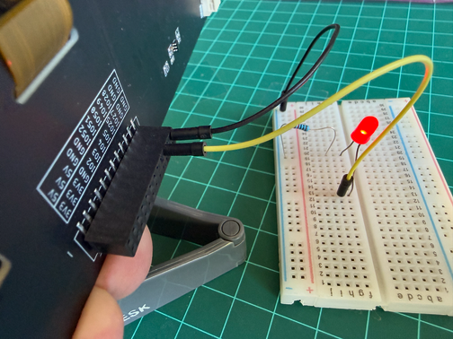

---

## Lesson 07 — Turn on the Screen

**Objective:** Initialize the 10.1-inch IPS display using LVGL and draw backgrounds, labels, and shapes. *(~30 min)*

### Key Concepts

Lesson 02 only needed a single GPIO component and a FreeRTOS task. Lesson 07 adds the full display stack on top of that foundation:

- Powers the LCD via on-chip LDOs.
- Initializes the backlight using PWM on a GPIO.
- Sets up the MIPI DSI bus and the EK79007 LCD panel driver.
- Initializes LVGL and registers the panel as an LVGL display via `esp_lvgl_port`.
- Uses LVGL APIs to draw text and shapes on screen.

The conceptual jump is: `toggle GPIO → fully initialize display pipeline → draw with LVGL`.

### New BSP Component: `bsp_illuminate`

`bsp_illuminate` wraps all display-related hardware logic behind four clean functions:

- `blight_init()` and `set_lcd_blight(uint32_t brightness)` — configure a backlight GPIO for LEDC PWM and map brightness 0–100 to a duty cycle.
- `display_port_init()` / `display_port_deinit()` — create the MIPI DSI bus and DBI IO, configure resolution, color format, timing, and the EK79007 controller.
- `lvgl_init()` — initialize the LVGL core (task, timer, memory, draw buffers) and register the LCD panel as an LVGL display with the correct resolution and buffering.
- `display_init()` — orchestrates the above sequence: backlight → display port → LVGL.

The main code only calls `display_init()` and `set_lcd_blight(100)`, without touching any LCD registers directly.

To support this, `bsp_illuminate.h` pulls in three managed ESP-IDF components whose versions are pinned in `idf_component.yml` so the build system downloads them automatically into `managed_components/`:

- `esp_lcd_ek79007` — panel driver
- `esp_lvgl_port` — LVGL binding
- `lvgl` — the graphics library itself

### Main Flow

#### System Initialization

`system_init()` in `main.c` does the following:

1. Acquires LDO channels 3 and 4 with `esp_ldo_acquire_channel()`, configuring voltages (2.5 V and 3.3 V) to power the LCD.
2. Calls `display_init()` to initialize the backlight GPIO, MIPI DSI bus, and LVGL.
3. Sets backlight brightness to 100% via `set_lcd_blight(100)`.

If any step fails, `init_fail_handler()` prints the error and halts in an infinite loop.

#### Drawing Text with LVGL

`lvgl_show_hello_elecrow()` demonstrates the LVGL drawing pattern:

```c
static void lvgl_show_hello_elecrow(void)
{
    if (lvgl_port_lock(0) != true) {
        MAIN_ERROR("LVGL lock failed");
        return;
    }

    lv_obj_t *screen = lv_scr_act();
    lv_obj_set_style_bg_color(screen, LV_COLOR_WHITE, LV_PART_MAIN);
    lv_obj_set_style_bg_opa(screen, LV_OPA_COVER, LV_PART_MAIN);

    static lv_style_t label_style;
    lv_style_init(&label_style);
    lv_style_set_text_font(&label_style, &lv_font_montserrat_42);
    lv_style_set_text_color(&label_style, LV_COLOR_BLACK);
    lv_style_set_bg_opa(&label_style, LV_OPA_TRANSP);

    lv_obj_t *label = lv_label_create(screen);
    lv_obj_add_style(label, &label_style, LV_PART_MAIN);
    lv_label_set_text(label, "Hello Elecrow");
    lv_obj_center(label);

    lvgl_port_unlock();
}
```

The mutex pattern (`lvgl_port_lock` / `lvgl_port_unlock`) is critical: LVGL is not thread-safe, so every UI modification from outside the LVGL task must be wrapped in this lock pair.

`app_main()` simply calls `system_init()` and then `lvgl_show_hello_elecrow()`.

This is the key contrast with Lesson 02: instead of one GPIO task, Lesson 07 uses one initialization helper and one drawing helper to control an entire display pipeline.

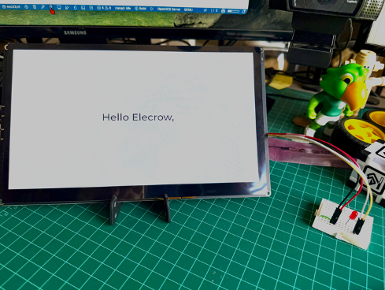

### Adding a Second Line of Text

To add a second line below the first, reuse the same style and use `lv_obj_align_to` to position it relative to the first label:

```c
// First line (existing)
lv_obj_t *label1 = lv_label_create(screen);
lv_obj_add_style(label1, &label_style, LV_PART_MAIN);
lv_label_set_text(label1, "Hello Elecrow");
lv_obj_center(label1);

// Second line
lv_obj_t *label2 = lv_label_create(screen);
lv_obj_add_style(label2, &label_style, LV_PART_MAIN);
lv_label_set_text(label2, "Greetings from the south of the world.");
lv_obj_align_to(label2, label1, LV_ALIGN_OUT_BOTTOM_MID, 0, 10);
```

`lv_obj_align_to(label2, label1, LV_ALIGN_OUT_BOTTOM_MID, 0, 10)` positions `label2` directly below `label1` with a 10-pixel vertical gap. Reusing the same `lv_style_t` for both keeps typography consistent and avoids re-initializing the style on every call.

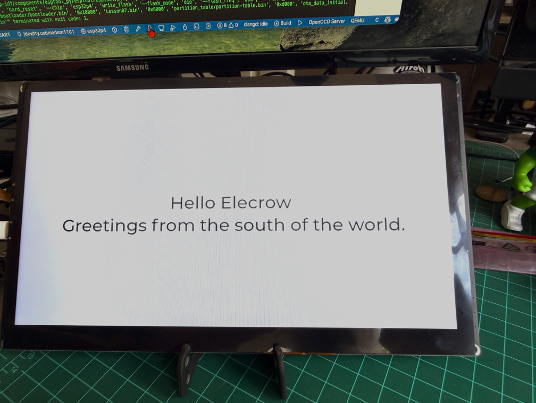

### Drawing a Rectangle Around the Text

To draw a framed box around both lines, create a parent container object and place the labels inside it. The container is styled with a border and sized automatically to fit its children:

```c
static lv_style_t rect_style;
static bool rect_style_inited = false;
if (!rect_style_inited) {
    lv_style_init(&rect_style);
    lv_style_set_border_width(&rect_style, 4);
    lv_style_set_border_color(&rect_style, LV_COLOR_BLACK);
    lv_style_set_border_opa(&rect_style, LV_OPA_COVER);
    lv_style_set_radius(&rect_style, 10);
    lv_style_set_pad_all(&rect_style, 20);
    lv_style_set_bg_opa(&rect_style, LV_OPA_TRANSP);
    rect_style_inited = true;
}

// Container
lv_obj_t *rect = lv_obj_create(screen);
lv_obj_add_style(rect, &rect_style, LV_PART_MAIN);
lv_obj_set_size(rect, LV_SIZE_CONTENT, LV_SIZE_CONTENT);
lv_obj_center(rect);

// Labels as children of the container
lv_obj_t *label1 = lv_label_create(rect);
lv_obj_add_style(label1, &label_style, LV_PART_MAIN);
lv_label_set_text(label1, "Hello Elecrow");
lv_obj_align(label1, LV_ALIGN_TOP_MID, 0, 0);

lv_obj_t *label2 = lv_label_create(rect);
lv_obj_add_style(label2, &label_style, LV_PART_MAIN);
lv_label_set_text(label2, "Greetings from the south of the world.");
lv_obj_align_to(label2, label1, LV_ALIGN_OUT_BOTTOM_MID, 0, 10);
```

`LV_SIZE_CONTENT` makes the container auto-size to fit its children plus the 20-pixel padding. Centering the container then centers both the box and the text together, regardless of screen resolution.

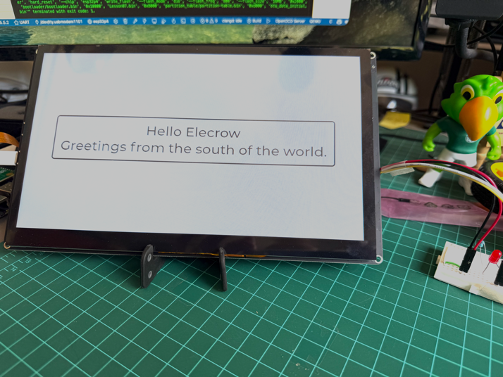

---

## Lesson 09 — LED Control via Touch Screen

**Objective:** Add capacitive touch input to the display and use LVGL buttons to control the external LED. *(~20 min)*

### What's New Compared to Lesson 07

Each lesson builds incrementally. The new additions in Lesson 09 are:

- `bsp_i2c` — initializes the shared I2C bus that the touch controller uses.
- `bsp_display` — registers a touch driver as an LVGL input device.
- LVGL button objects and event callbacks that call `gpio_extra_set_level(true/false)`.

This closes the loop between the graphical UI and the physical world: a finger on the screen toggles a physical LED.

### Initialization Path

`system_init()` in Lesson 09 adds two steps before display initialization:

1. Acquire LDO3 (2.5 V) and LDO4 (3.3 V) for LCD and touch power.
2. Initialize I2C (`i2c_init()`) for the touch IC.
3. Initialize the touch driver (`bsp_display_init()`), which registers the LVGL input device.
4. Initialize display and LVGL (`display_init()`, `set_lcd_blight(100)`) — same as Lesson 07.
5. Initialize LED GPIO (`gpio_extra_init()`) — same as Lesson 02.
6. Call the UI builder to create the title, buttons, and status label.

With both a display driver and an input driver registered, LVGL can receive touch events and route them to our button callbacks.

### LVGL Buttons and Callbacks

The UI function creates two buttons and a status label:

```c
static bool s_led_on = false;
static lv_obj_t *s_led_status_label = NULL;

static void btn_on_click_event(lv_event_t *e)
{
    (void)e;
    gpio_extra_set_level(true);
    s_led_on = true;
    update_led_status_label();
}

static void btn_off_click_event(lv_event_t *e)
{
    (void)e;
    gpio_extra_set_level(false);
    s_led_on = false;
    update_led_status_label();
}
```

The `LV_EVENT_CLICKED` event fires once per tap — there is no need to poll the touch state manually. LVGL's internal task handles debouncing and dispatches the event to the registered callback.

### Adding a Status Window

A framed status window near the bottom of the screen gives visual feedback:

```c
static lv_style_t status_style;
static bool status_style_inited = false;
if (!status_style_inited) {
    lv_style_init(&status_style);
    lv_style_set_border_width(&status_style, 2);
    lv_style_set_border_color(&status_style, LV_COLOR_BLACK);
    lv_style_set_border_opa(&status_style, LV_OPA_COVER);
    lv_style_set_pad_all(&status_style, 8);
    lv_style_set_bg_opa(&status_style, LV_OPA_TRANSP);
    status_style_inited = true;
}

lv_obj_t *status_cont = lv_obj_create(scr);
lv_obj_add_style(status_cont, &status_style, LV_PART_MAIN);
lv_obj_set_size(status_cont, LV_SIZE_CONTENT, LV_SIZE_CONTENT);
lv_obj_align(status_cont, LV_ALIGN_BOTTOM_MID, 0, -20);

s_led_status_label = lv_label_create(status_cont);
lv_label_set_text(s_led_status_label, "LED Status: OFF");
lv_obj_center(s_led_status_label);
```

A helper function refreshes the label text whenever the LED state changes:

```c
static void update_led_status_label(void)
{
    if (!s_led_status_label) return;
    lv_label_set_text(s_led_status_label,
                      s_led_on ? "LED Status: ON" : "LED Status: OFF");
}
```

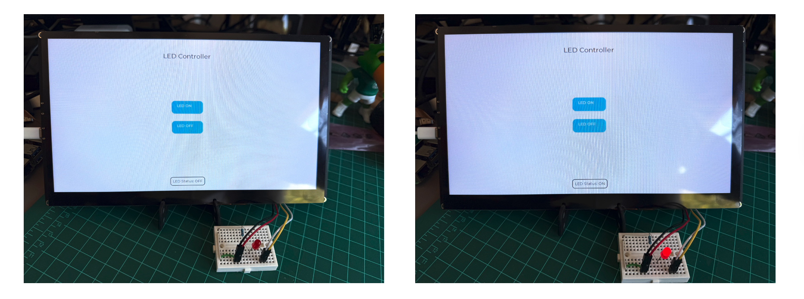

---

## Lesson 10 — Temperature & Humidity Sensor

**Objective:** Read temperature and relative humidity from a DHT20 sensor over I2C and display live readings on the screen. *(~25 min)*

### The DHT20 Sensor

The [DHT20 Grove sensor](https://www.seeedstudio.com/Grove-Temperature-Humidity-Sensor-V2-0-DHT20-p-4967.html) communicates over I2C and connects directly to the CrowPanel's Grove I2C header.


| **Parameter**      | **Value**                                         |
|--------------------|---------------------------------------------------|
| Interface          | I2C (fixed address 0x38)                          |
| Temperature range  | -40 to +80 °C (±0.5 °C typical)                  |
| Humidity range     | 0–100 % RH (±3 % typical)                        |
| Supply voltage     | 2.2–5.5 V                                         |
| CrowPanel connector| Grove I2C (SDA: GPIO 7, SCL: GPIO 8)              |

The same I2C bus used by the touch controller in Lesson 09 also serves the DHT20 — no extra wiring or bus initialization is needed.

### What Lesson 10 Does

- Powers the LCD and sensor via LDO3 (2.5 V) and LDO4 (3.3 V).
- Initializes the shared I2C bus with `i2c_init()`, then the DHT20 with `dht20_begin()`.
- Initializes the display and LVGL with `display_init()`, then sets backlight to 100%.
- Creates one centered LVGL label (`dht20_data`) to show temperature and humidity.
- Starts a FreeRTOS task `dht20_read_task` that every second reads the sensor and updates the label.

The core pattern is: **one task continuously updates one label with I2C sensor values.**

### LVGL Display Setup: `dht20_display()`

```c
static void dht20_display(void)
{
    if (!lvgl_port_lock(0)) return;

    lv_obj_t *screen = lv_scr_act();
    lv_obj_set_style_bg_color(screen, lv_color_hex(0x000000), LV_PART_MAIN);
    lv_obj_set_style_bg_opa(screen, LV_OPA_COVER, LV_PART_MAIN);

    dht20_data_label = lv_label_create(screen);
    lv_obj_set_style_text_font(dht20_data_label, &lv_font_montserrat_30, 0);
    lv_obj_set_style_text_color(dht20_data_label, lv_color_hex(0xFFFFFF), 0);
    lv_label_set_text(dht20_data_label, "Temperature = 0.0 C  Humidity = 0.0%");
    lv_obj_center(dht20_data_label);

    lvgl_port_unlock();
}
```

### Label Update: `update_dht20_value()`

```c
static void update_dht20_value(float temperature, float humidity)
{
    if (!dht20_data_label) return;

    char buffer[64];
    snprintf(buffer, sizeof(buffer),
             "Temperature = %.1f C  Humidity = %.1f %%",
             temperature, humidity);
    lv_label_set_text(dht20_data_label, buffer);
}
```

This function is GUI-only. The sensor task locks LVGL before calling it.

### Sensor Task: `dht20_read_task()`

```c
static void dht20_read_task(void *param)
{
    (void)param;
    dht20_data_t measurements;

    while (1) {
        if (dht20_is_calibrated() != ESP_OK) {
            dht20_begin();
            vTaskDelay(pdMS_TO_TICKS(100));
            continue;
        }

        if (dht20_read_data(&measurements) != ESP_OK) {
            if (lvgl_port_lock(0)) {
                lv_label_set_text(dht20_data_label, "dht20 read data error");
                lvgl_port_unlock();
            }
        } else {
            if (lvgl_port_lock(0)) {
                update_dht20_value(measurements.temperature, measurements.humidity);
                lvgl_port_unlock();
            }
            ESP_LOGI(TAG, "Temp: %.1f C  Humidity: %.1f %%",
                     measurements.temperature, measurements.humidity);
        }

        vTaskDelay(pdMS_TO_TICKS(1000));
    }
}
```

Notice that every LVGL call inside the task is wrapped in `lvgl_port_lock` / `lvgl_port_unlock`. This is mandatory any time LVGL is modified from a task other than the internal LVGL task.

### `app_main` Flow

```c
void app_main(void)
{
    Init();                         // LDOs + I2C + DHT20 + display
    set_lcd_blight(100);
    dht20_display();                // build the LVGL screen
    xTaskCreate(dht20_read_task,   // start the sensor loop
                "dht20_task", 4096, NULL, configMAX_PRIORITIES - 5, NULL);
}
```

This matches the established pattern: one init function, one UI builder, one background task.

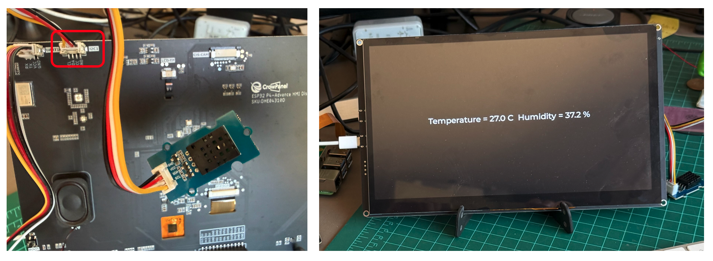

---

## Mini-Project — Home Panel Controller

**Objective:** Combine Lessons 09 and 10 into a single screen: LED control buttons, a status window, and live DHT20 sensor readings — all on one display. *(~30 min)*

### Introduction

In isolation, Lessons 09 and 10 each demonstrate one capability. Here we merge both into a **Home Panel Controller** — a single LVGL screen with a title, LED ON/OFF buttons, a status window showing the current LED state, and a live temperature/humidity readout updated every second.

This is a good template for any real-world HMI project that needs to combine actuator control with sensor monitoring.

### Project Structure

Start from the Lesson 09 project and add the `bsp_dht20` component from Lesson 10.

**Step 1:** Copy the DHT20 component into the peripheral folder:

```
peripheral/bsp_dht20/
  bsp_dht20.c
  include/bsp_dht20.h
  CMakeLists.txt
```

`peripheral/bsp_dht20/CMakeLists.txt`:

```cmake
idf_component_register(
    SRCS "bsp_dht20.c"
    INCLUDE_DIRS "include"
    REQUIRES bsp_i2c esp_timer
)
```

**Step 2:** Update `main/CMakeLists.txt` to depend on the new component:

```cmake
idf_component_register(
    SRCS ${main}
    INCLUDE_DIRS "include"
    REQUIRES
        bsp_extra
        bsp_display
        bsp_illuminate
        bsp_i2c
        bsp_dht20        # added
        esp_timer
)
```

**Step 3:** Add the include in `main.c`:

```c
#include "bsp_dht20.h"
```

### The Combined UI Screen

Three global pointers track the widgets that need runtime updates:

```c
static bool s_led_on = false;
static lv_obj_t *s_led_status_label = NULL;
static lv_obj_t *s_dht20_label      = NULL;
```

`create_home_panel_ui()` builds the full screen under a single LVGL mutex:

```c
static void create_home_panel_ui(void)
{
    if (!lvgl_port_lock(0)) return;

    lv_obj_t *scr = lv_scr_act();
    lv_obj_set_style_bg_color(scr, lv_color_hex(0xFFFFFF), LV_PART_MAIN);
    lv_obj_set_style_bg_opa(scr, LV_OPA_COVER, LV_PART_MAIN);

    // Title
    lv_obj_t *title = lv_label_create(scr);
    lv_label_set_text(title, "HOME Panel Controller");
    lv_obj_align(title, LV_ALIGN_TOP_MID, 0, 50);
    lv_obj_set_style_text_font(title, &lv_font_montserrat_24, 0);

    // DHT20 label (near the top, below title)
    s_dht20_label = lv_label_create(scr);
    lv_obj_set_style_text_font(s_dht20_label, &lv_font_montserrat_20, 0);
    lv_obj_set_style_text_color(s_dht20_label, lv_color_hex(0x000000), 0);
    lv_label_set_text(s_dht20_label, "Temperature = 0.0 C  Humidity = 0.0 %");
    lv_obj_align(s_dht20_label, LV_ALIGN_CENTER, 0, -150);

    // LED ON button
    lv_obj_t *btn_on = lv_btn_create(scr);
    lv_obj_set_size(btn_on, 120, 50);
    lv_obj_align(btn_on, LV_ALIGN_CENTER, 0, -40);
    lv_obj_add_event_cb(btn_on, btn_on_click_event, LV_EVENT_CLICKED, NULL);
    lv_label_set_text(lv_label_create(btn_on), "LED ON");

    // LED OFF button
    lv_obj_t *btn_off = lv_btn_create(scr);
    lv_obj_set_size(btn_off, 120, 50);
    lv_obj_align(btn_off, LV_ALIGN_CENTER, 0, 40);
    lv_obj_add_event_cb(btn_off, btn_off_click_event, LV_EVENT_CLICKED, NULL);
    lv_label_set_text(lv_label_create(btn_off), "LED OFF");

    // Status window (bottom)
    lv_obj_t *status_cont = lv_obj_create(scr);
    lv_obj_set_size(status_cont, LV_SIZE_CONTENT, LV_SIZE_CONTENT);
    lv_obj_align(status_cont, LV_ALIGN_BOTTOM_MID, 0, -20);

    s_led_status_label = lv_label_create(status_cont);
    lv_label_set_text(s_led_status_label, "LED Status: OFF");
    lv_obj_center(s_led_status_label);

    lvgl_port_unlock();
}
```

### System Initialization

`system_init()` combines the initialization steps from both lessons in order:

```c
static void system_init(void)
{
    // 1. Power (LDO3 at 2.5 V, LDO4 at 3.3 V)
    // 2. I2C bus (shared by touch and DHT20)
    // 3. Touch panel → LVGL input driver
    // 4. DHT20 sensor
    // 5. Display and LVGL
    // 6. Backlight at 100%
    // 7. LED GPIO (off at startup)

    gpio_extra_set_level(false);
    s_led_on = false;

    // Build the combined UI
    create_home_panel_ui();
    update_led_status_label();

    // Start the sensor polling task
    xTaskCreate(dht20_read_task, "dht20_task", 4096,
                NULL, configMAX_PRIORITIES - 5, NULL);
}
```

`app_main` is intentionally minimal:

```c
void app_main(void)
{
    system_init();
    while (1) { vTaskDelay(pdMS_TO_TICKS(1000)); }
}
```

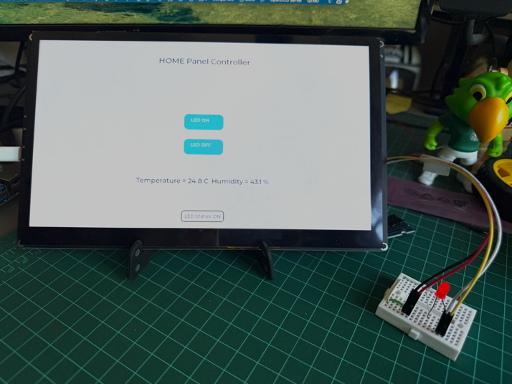

---

## Lesson 16 — Live Weather via Wi-Fi

**Objective:** Connect to a Wi-Fi network, perform an HTTPS GET request to a weather API, parse the JSON response with cJSON, and display the results on screen. *(~40 min)*

### Architecture

The data flow is four sequential stages:

**Wi-Fi connection → HTTPS GET → JSON parsing → LVGL rendering**

ESP-IDF provides `esp_wifi` and `esp_http_client` for the network stack, and `cJSON` for JSON parsing. The lesson encapsulates HTTP and JSON concerns inside a `weather.c` module so that the application only calls one function: `weather_get_weather`.

### The `weather.c` Module

#### Object Pattern: `weather_create` / `weather_destroy`

`weather_t` is a small structure holding a JSON response buffer and any HTTP callback state. The module treats it like a C "object":

```c
weather_t* weather_create(void)
{
    weather_t *weather = malloc(sizeof(weather_t));
    if (!weather) return NULL;

    weather->json_response = malloc(JSON_BUFFER_SIZE);
    if (!weather->json_response) {
        free(weather);
        return NULL;
    }
    memset(weather->json_response, 0, JSON_BUFFER_SIZE);
    return weather;
}
```

Always call `weather_destroy(w)` when you are done to free both allocations.

#### Receiving Data: `http_event_handler`

ESP-IDF's HTTP client calls this handler every time a chunk of data arrives over the connection. The handler appends each chunk to `weather->json_response` using `strncat`, up to `JSON_BUFFER_SIZE`. By the end of the request, `json_response` holds the complete JSON string.

```c
static esp_err_t http_event_handler(esp_http_client_event_t *evt)
{
    weather_t *weather_inst = (weather_t*)evt->user_data;
    if (!weather_inst || !weather_inst->json_response) return ESP_FAIL;

    if (evt->event_id == HTTP_EVENT_ON_DATA) {
        if (evt->data_len <
            JSON_BUFFER_SIZE - strlen(weather_inst->json_response) - 1) {
            strncat(weather_inst->json_response,
                    (char*)evt->data, evt->data_len);
        }
    }
    return ESP_OK;
}
```

#### Performing the Request: `weather_http_get_json`

```c
static bool weather_http_get_json(weather_t *weather)
{
    memset(weather->json_response, 0, JSON_BUFFER_SIZE);

    esp_http_client_config_t config = {
        .url           = WEATHER_JSON_URL,
        .event_handler = http_event_handler,
        .user_data     = weather,
    };

    esp_http_client_handle_t client = esp_http_client_init(&config);
    if (!client) return false;

    esp_err_t err    = esp_http_client_perform(client);
    bool      success = (err == ESP_OK);

    esp_http_client_cleanup(client);
    return success;
}
```

Think of this as "download JSON into `weather->json_response`."

#### Parsing JSON: `weather_analyse_weather_json`

The default Lesson 16 parser is written for a demo API with a custom `data` object. We will replace it with a real-world parser for OpenWeatherMap (see below). The structure is the same: use `cJSON_Parse`, navigate to the fields you need, extract values, then call `cJSON_Delete` to free memory.

#### The Public API: `weather_get_weather`

```c
bool weather_get_weather(weather_t *weather,
                         double *temp_c,
                         char   *weather_text,
                         int    *timestamp)
{
    if (!weather) return false;
    if (!weather_http_get_json(weather)) return false;
    if (!weather_analyse_weather_json(weather, weather->json_response,
                                      temp_c, weather_text, timestamp))
        return false;
    return true;
}
```

In your main loop:

```c
weather_t *w = weather_create();
double temp_c;
char   condition[64];
int    ts;

if (weather_get_weather(w, &temp_c, condition, &ts)) {
    // Format and show: "Temp = 23.4 C, Sunny"
} else {
    // Show "Weather fetch error" on LVGL label
}
weather_destroy(w);
```

### Entering Wi-Fi Credentials

Before building, set your network credentials in `bsp_wifi/bsp_wifi.c`:

```c
char wifi_ssid_[64]     = "YOUR_NETWORK_NAME";
char wifi_password_[64] = "YOUR_PASSWORD";
```

### Switching to a Real Weather API: OpenWeatherMap

The demo API in Lesson 16 returns placeholder data. Switching to a real service requires two changes: updating the URL macro and rewriting the JSON parser to match the new response shape.

**Step 1 — Create a free OpenWeatherMap account** at [openweathermap.org](https://openweathermap.org/) and obtain an API key.

**Step 2 — Update the URL** in `weather.h`:

```c
#define WEATHER_JSON_URL \
    "https://api.openweathermap.org/data/2.5/weather?q=Rio%20de%20Janeiro,BR&units=metric&appid=YOUR_API_KEY"
```

**Step 3 — Understand the response shape.** The OpenWeatherMap current weather endpoint returns:

```json
{
  "weather": [{ "description": "light rain" }],
  "main":    { "temp": 27.66 },
  "dt":      1771871097,
  "name":    "Rio de Janeiro"
}
```

We extract three fields: `main.temp` (temperature in °C), `weather[0].description` (condition string), and `dt` (UNIX timestamp).

**Step 4 — Replace `weather_analyse_weather_json`:**

```c
static bool weather_analyse_weather_json(weather_t *weather,
                                         const char *json_str,
                                         double     *temp_c,
                                         char *const weather_text,
                                         int        *timestamp)
{
    (void)weather;

    cJSON *root = cJSON_Parse(json_str);
    if (!root) { ESP_LOGE(TAG, "JSON parse failed"); return false; }

    // main.temp
    cJSON *main_node = cJSON_GetObjectItemCaseSensitive(root, "main");
    cJSON *temp_node = cJSON_GetObjectItemCaseSensitive(main_node, "temp");
    if (!cJSON_IsNumber(temp_node)) {
        cJSON_Delete(root); return false;
    }
    *temp_c = temp_node->valuedouble;

    // weather[0].description
    cJSON *weather_array = cJSON_GetObjectItemCaseSensitive(root, "weather");
    cJSON *weather0      = cJSON_GetArrayItem(weather_array, 0);
    cJSON *desc_node     = cJSON_GetObjectItemCaseSensitive(weather0, "description");
    if (!cJSON_IsString(desc_node) || !desc_node->valuestring) {
        cJSON_Delete(root); return false;
    }
    strncpy(weather_text, desc_node->valuestring,
            strlen(desc_node->valuestring) + 1);

    // dt
    cJSON *dt_node = cJSON_GetObjectItemCaseSensitive(root, "dt");
    if (!cJSON_IsNumber(dt_node)) {
        cJSON_Delete(root); return false;
    }
    *timestamp = dt_node->valueint;

    cJSON_Delete(root);
    return true;
}
```

The `weather_get_weather` public function and all LVGL rendering code remain unchanged — only the URL and the parser changed.

### No-API-Key Alternative: Open-Meteo

[Open-Meteo](https://api.open-meteo.com/) provides current weather data without any registration or API key. Use latitude and longitude for your city:

```
https://api.open-meteo.com/v1/forecast?latitude=-22.90&longitude=-43.20&current=temperature_2m
```

The response structure is:

```json
{
  "current": {
    "time":          "2026-02-24T12:15",
    "temperature_2m": 27.8
  }
}
```

Update the URL macro and write a matching parser that navigates to `current.temperature_2m` instead of `main.temp`. The rest of the application code stays the same.

### Background Image Integration

Lesson 16 uses a full-screen LVGL image as a wallpaper instead of a plain background color. The workflow is:

**1. Prepare the image.** Export a PNG or JPG at 1024×600 pixels. A free online editor such as [Fotor](https://www.fotor.com/photo-editor-app/editor/basic) works well.

**2. Convert to a C array.** Open the [LVGL Image Converter](https://lvgl.io/tools/imageconverter), upload the file, select `CF_TRUE_COLOR_ALPHA` and `C array` output, and download the generated `.c` file (e.g., `image_both.c`). The file contains a pixel array and a descriptor:

```c
const lv_img_dsc_t image_both = {
    .header.cf = LV_IMG_CF_TRUE_COLOR_ALPHA,
    .header.w  = 1024,
    .header.h  = 600,
    .data_size = ...,
    .data      = image_both_map,
};
```

**3. Add to the project.** Copy `image_both.c` into `main/ui/` and list it in `CMakeLists.txt`. Declare the image in a header:

```c
LV_IMG_DECLARE(image_both);
```

**4. Use in UI code.** Create an `lv_img` object, set the image as its source, and size it to fill the screen:

```c
lv_obj_t *ui_home = lv_img_create(lv_scr_act());
lv_img_set_src(ui_home, &image_both);
lv_obj_align(ui_home, LV_ALIGN_TOP_LEFT, 0, 0);
lv_obj_set_size(ui_home, LV_HOR_RES, LV_VER_RES);
lv_obj_clear_flag(ui_home, LV_OBJ_FLAG_SCROLLABLE | LV_OBJ_FLAG_SCROLL_ELASTIC);
```

All other widgets (weather labels, icons) are created on the same `lv_scr_act()`, so they appear layered on top of the background.

> The `image_both_map[]` pixel array is auto-generated by the converter — do not edit it manually. To update the artwork, re-convert the PNG and replace the file.

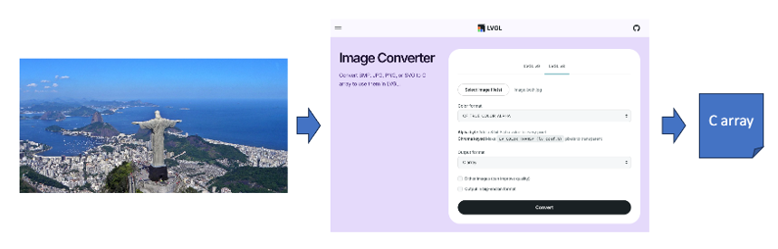


---

## Conclusion

Working through these five lessons, we took the CrowPanel Advanced from blinking a single LED all the way to a live, connected weather dashboard — and every step built directly on the one before it.

### What We Covered

**Lesson 02 — GPIO & FreeRTOS.** We set up ESP-IDF, learned how the `bsp_extra` component cleanly separates hardware concerns from application logic, and used a FreeRTOS task to blink an external LED on GPIO 48. The component architecture established here — with a `CMakeLists.txt`, a header, and an implementation file — repeats in every subsequent lesson.

**Lesson 07 — Display pipeline.** We powered the LCD via on-chip LDOs, configured the MIPI DSI bus and the EK79007 panel driver, initialized LVGL, and drew text and shapes on the 1024×600 screen. The `lvgl_port_lock` / `lvgl_port_unlock` mutex pattern, introduced here, becomes mandatory in every subsequent lesson that modifies the UI from a background task.

**Lesson 09 — Touch input.** We registered a touch driver as an LVGL input device and wired button callbacks directly to `gpio_extra_set_level`, closing the loop between the visual UI and the physical world. The touch controller shares the same I2C bus as the sensor in the next lesson.

**Lesson 10 — Sensor integration.** We read temperature and humidity from a DHT20 over I2C, updated LVGL labels in real time from a FreeRTOS task, and learned why every UI modification from a non-LVGL task must be protected by the port lock.

**Lesson 16 — Wi-Fi & REST API.** We connected to Wi-Fi 6, performed an HTTPS GET with `esp_http_client`, and parsed the OpenWeatherMap JSON response with cJSON — then replaced the demo API for live data by changing exactly two things: the URL macro and the parser function. We also built a full LVGL image pipeline, converting a PNG at 1024×600 into a C array compiled directly into the firmware.

### The Bigger Picture

The CrowPanel ESP32-P4 is a capable platform not only for HMI dashboards but also for **Edge AI applications**. The on-chip AI accelerator, 32 MB of PSRAM, and Wi-Fi 6 connectivity open the door to on-device inference — keyword spotting, image classification, anomaly detection — displayed and controlled through the very LVGL interface we built here. That is a natural next step for anyone interested in bringing machine learning to the edge without relying on the cloud.

The component architecture used throughout (`bsp_extra`, `bsp_illuminate`, `bsp_i2c`, `bsp_dht20`, `app_weather`) is worth carrying forward into your own projects. Each component owns a single responsibility, exposes a minimal API, and integrates cleanly with the ESP-IDF build system. Adding new peripherals or replacing one sensor with another becomes a matter of swapping one component — not rewriting the application.

Happy making!

---

*Tutorial by [Marcelo Rovai](https://www.linkedin.com/in/marcelo-jose-rovai-brazil-chile/) — Professor Honoris Causa, [UNIFEI](https://international.unifei.edu.br/) - Federal University of Itajuba | [TinyML4D](https://tinyml.seas.harvard.edu/team) - Academic Network Co-Chair | [Edge AIP](https://www.edgeaifoundation.org/posts/announcing-the-tinyml-foundation-industry-academia-partnership) **- **Academia-Industry Partnership Co-Chair*

